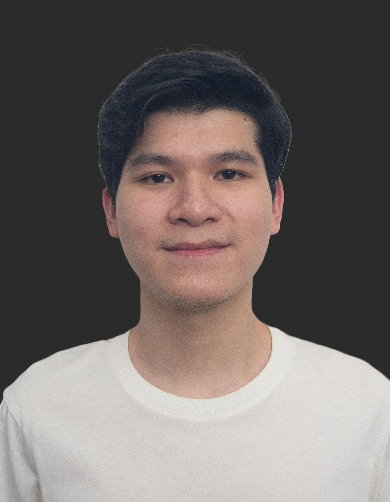
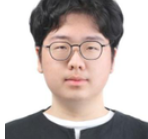
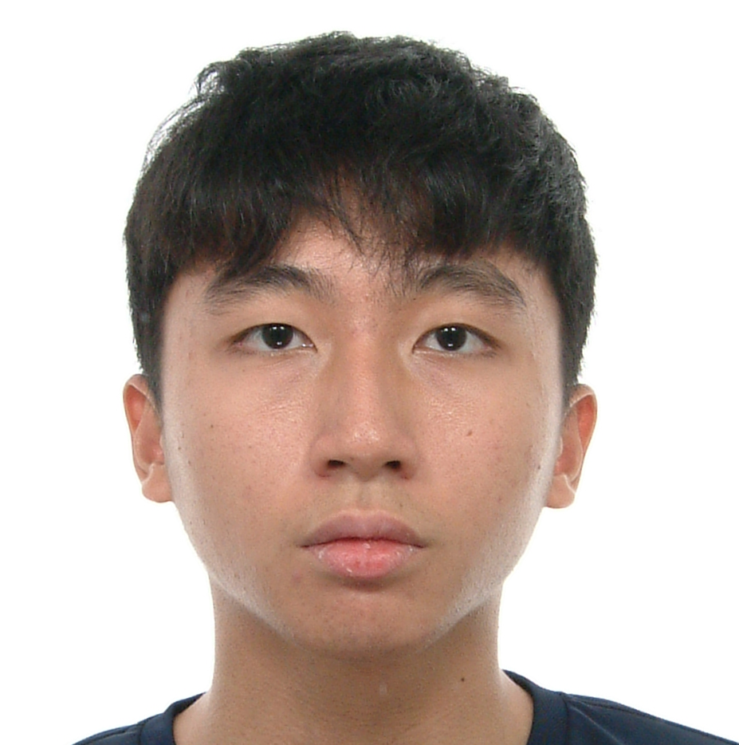

We are a team based in the [School of Computing, National University of Singapore](https://www.comp.nus.edu.sg).

You can reach us at the email `cs2103t.t16.1@gmail.com`

## Project team

### Nguyen Quang Minh

[[github](https://github.com/minhmxc)]
[[portfolio](https://minhmxc.github.io)]

* Role: Integration
* Responsibilities: In charge of versioning of the code, maintaining the code repository, 
integrating various parts of the software to create a whole

### Leu Tho Anh Duy

[[github](http://github.com/duyLeu)]
[[portfolio](team/duyLeu.md)]

* Role: Developer
* Responsibilities: Develop features for the application

### Mai Xiong Kai

[[github](http://github.com/johndoe)]
[[portfolio](team/johndoe.md)]

- Role: Developer
- Responsibilities: Documentation; Responsible for the quality of various project documents.

### Seo Yuntae

[[github](http://github.com/yuntaeseo)]
[[portfolio](http://github.com/yuntaeseo)]

* Role: Code quality 
* Responsibilities: Looks after code quality, ensures adherence to coding standards

### Gordon Tay

[[github](http://github.com/gordontzx)]
[[portfolio](http://github.com/gordontzx)]

* Role: Developer
* Responsibilities: in charge of general code logic

