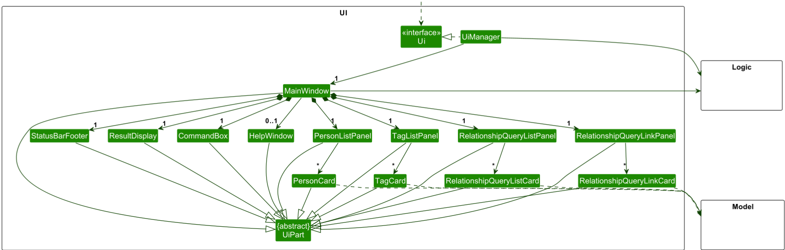

* Table of Contents
  {:toc}

--------------------------------------------------------------------------------------------------------------------

## **Acknowledgements**

This project is based on the AddressBook-Level3 project created by the [SE-EDU initiative](https://se-education.org).

--------------------------------------------------------------------------------------------------------------------

## **Setting up, getting started**

Refer to the guide [_Setting up and getting started_](SettingUp.md).

--------------------------------------------------------------------------------------------------------------------

## **Design**

:bulb: **Tip:** The `.puml` files used to create diagrams are in this document `docs/diagrams` folder. Refer to the [
_PlantUML Tutorial_ at se-edu/guides](https://se-education.org/guides/tutorials/plantUml.html) to learn how to create
and edit diagrams.

### Architecture

The ***Architecture Diagram*** given above explains the high-level design of the App.

Given below is a quick overview of main components and how they interact with each other.

**Main components of the architecture**

**`Main`** (consisting of classes [
`Main`](../src/main/java/seedu/address/Main.java) and [
`MainApp`](../src/main/java/seedu/address/MainApp.java)) is in
charge of the app launch and shut down.

* At app launch, it initializes the other components in the correct sequence, and connects them up with each other.
* At shut down, it shuts down the other components and invokes cleanup methods where necessary.

The bulk of the app's work is done by the following four components:

* [**`UI`**](#ui-component): The UI of the App.
* [**`Logic`**](#logic-component): The command executor.
* [**`Model`**](#model-component): Holds the data of the App in memory.
* [**`Storage`**](#storage-component): Reads data from, and writes data to, the hard disk.

[**`Commons`**](#common-classes) represents a collection of classes used by multiple other components.

**How the architecture components interact with each other**

The *Sequence Diagram* below shows how the components interact with each other for the scenario where the user issues
the command `delete 1`.

Each of the four main components (also shown in the diagram above),

* defines its *API* in an `interface` with the same name as the Component.
* implements its functionality using a concrete `{Component Name}Manager` class (which follows the corresponding API
  `interface` mentioned in the previous point.

For example, the `Logic` component defines its API in the `Logic.java` interface and implements its functionality using
the `LogicManager.java` class which follows the `Logic` interface. Other components interact with a given component
through its interface rather than the concrete class (reason: to prevent outside component's being coupled to the
implementation of a component), as illustrated in the (partial) class diagram below.

The sections below give more details of each component.

### UI component

The **API** of this component is specified in [
`Ui.java`](../src/main/java/seedu/address/ui/Ui.java)

The UI consists of a `MainWindow` that is made up of parts e.g.`CommandBox`, `ResultDisplay`, `PersonListPanel`,
`StatusBarFooter` etc. All these, including the `MainWindow`, inherit from the abstract `UiPart` class which captures
the commonalities between classes that represent parts of the visible GUI.

The `UI` component uses the JavaFx UI framework. The layout of these UI parts are defined in matching `.fxml` files that
are in the `src/main/resources/view` folder. For example, the layout of the [
`MainWindow`](../src/main/java/seedu/address/ui/MainWindow.java)
is specified in [
`MainWindow.fxml`](../src/main/resources/view/MainWindow.fxml)

The `UI` component,

* executes user commands using the `Logic` component.
* listens for changes to `Model` data so that the UI can be updated with the modified data.
* keeps a reference to the `Logic` component, because the `UI` relies on the `Logic` to execute commands.
* depends on some classes in the `Model` component, as it displays `Person` object residing in the `Model`.

### Logic component

**API** : [
`Logic.java`](../src/main/java/seedu/address/logic/Logic.java)

Here's a (partial) class diagram of the `Logic` component:

The sequence diagram below illustrates the interactions within the `Logic` component, taking `execute("delete 1")` API
call as an example.

:information_source: **Note:** The lifeline for `DeleteCommandParser` should end at the destroy marker (X) but due to a limitation of PlantUML, the lifeline continues till the end of diagram.

How the `Logic` component works:

1. When `Logic` is called upon to execute a command, it is passed to an `AddressBookParser` object which in turn creates
   a parser that matches the command (e.g., `DeleteCommandParser`) and uses it to parse the command.
1. This results in a `Command` object (more precisely, an object of one of its subclasses e.g., `DeleteCommand`) which
   is executed by the `LogicManager`.
1. The command can communicate with the `Model` when it is executed (e.g. to delete a person). 
   Note that although this is shown as a single step in the diagram above (for simplicity), in the code it can take
   several interactions (between the command object and the `Model`) to achieve.
1. The result of the command execution is encapsulated as a `CommandResult` object which is returned back from `Logic`.

Here are the other classes in `Logic` (omitted from the class diagram above) that are used for parsing a user command:

How the parsing works:

* When called upon to parse a user command, the `AddressBookParser` class creates an `XYZCommandParser` (`XYZ` is a
  placeholder for the specific command name e.g., `AddCommandParser`) which uses the other classes shown above to parse
  the user command and create a `XYZCommand` object (e.g., `AddCommand`) which the `AddressBookParser` returns back as a
  `Command` object.
* All `XYZCommandParser` classes (e.g., `AddCommandParser`, `DeleteCommandParser`, ...) inherit from the `Parser`
  interface so that they can be treated similarly where possible e.g, during testing.

### Model component

**API** : [
`Model.java`](../src/main/java/seedu/address/model/Model.java)

The `Model` component,

* stores the address book data i.e., all `Person` objects (which are contained in a `UniquePersonList` object).
* stores the currently 'selected' `Person` objects (e.g., results of a search query) as a separate _filtered_ list which
  is exposed to outsiders as an unmodifiable `ObservableList<Person>` that can be 'observed' e.g. the UI can be bound to
  this list so that the UI automatically updates when the data in the list change.
* stores a `UserPref` object that represents the user’s preferences. This is exposed to the outside as a
  `ReadOnlyUserPref` objects.
* does not depend on any of the other three components (as the `Model` represents data entities of the domain, they
  should make sense on their own without depending on other components)

:information_source: **Note:** An alternative (arguably, a more OOP) model is given below. It has a `Tag` list in the `AddressBook`, which `Person` references. This allows `AddressBook` to only require one `Tag` object per unique tag, instead of each `Person` needing their own `Tag` objects. 

The `Person` component,

* stores all the fields related to a person.
* Tags are stored as IDs.

### Storage component

**API** : [
`Storage.java`](../src/main/java/seedu/address/storage/Storage.java)

The `Storage` component,

* can save both address book data and user preference data in JSON format, and read them back into corresponding
  objects.
* inherits from both `AddressBookStorage` and `UserPrefStorage`, which means it can be treated as either one (if only
  the functionality of only one is needed).
* depends on some classes in the `Model` component (because the `Storage` component's job is to save/retrieve objects
  that belong to the `Model`)

### Common classes

Classes used by multiple components are in the `seedu.address.commons` package.

--------------------------------------------------------------------------------------------------------------------

## **Implementation**

This section describes some noteworthy details on how certain features are implemented.

### \[Proposed\] Undo/redo feature

#### Proposed Implementation

The proposed undo/redo mechanism is facilitated by `VersionedAddressBook`. It extends `AddressBook` with an undo/redo
history, stored internally as an `addressBookStateList` and `currentStatePointer`. Additionally, it implements the
following operations:

* `VersionedAddressBook#commit()`— Saves the current address book state in its history.
* `VersionedAddressBook#undo()`— Restores the previous address book state from its history.
* `VersionedAddressBook#redo()`— Restores a previously undone address book state from its history.

These operations are exposed in the `Model` interface as `Model#commitAddressBook()`, `Model#undoAddressBook()` and
`Model#redoAddressBook()` respectively.

Given below is an example usage scenario and how the undo/redo mechanism behaves at each step.

Step 1. The user launches the application for the first time. The `VersionedAddressBook` will be initialized with the
initial address book state, and the `currentStatePointer` pointing to that single address book state.

Step 2. The user executes `delete 5` command to delete the 5th person in the address book. The `delete` command calls
`Model#commitAddressBook()`, causing the modified state of the address book after the `delete 5` command executes to be
saved in the `addressBookStateList`, and the `currentStatePointer` is shifted to the newly inserted address book state.

Step 3. The user executes `add n/David …​` to add a new person. The `add` command also calls
`Model#commitAddressBook()`, causing another modified address book state to be saved into the `addressBookStateList`.

:information_source: **Note:** If a command fails its execution, it will not call `Model#commitAddressBook()`, so the address book state will not be saved into the `addressBookStateList`.

Step 4. The user now decides that adding the person was a mistake, and decides to undo that action by executing the
`undo` command. The `undo` command will call `Model#undoAddressBook()`, which will shift the `currentStatePointer` once
to the left, pointing it to the previous address book state, and restores the address book to that state.

:information_source: **Note:** If the `currentStatePointer` is at index 0, pointing to the initial AddressBook state, then there are no previous AddressBook states to restore. The `undo` command uses `Model#canUndoAddressBook()` to check if this is the case. If so, it will return an error to the user rather
than attempting to perform the undo.

The following sequence diagram shows how an undo operation goes through the `Logic` component:

:information_source: **Note:** The lifeline for `UndoCommand` should end at the destroy marker (X) but due to a limitation of PlantUML, the lifeline reaches the end of diagram.

Similarly, how an undo operation goes through the `Model` component is shown below:

The `redo` command does the opposite — it calls `Model#redoAddressBook()`, which shifts the `currentStatePointer` once
to the right, pointing to the previously undone state, and restores the address book to that state.

:information_source: **Note:** If the `currentStatePointer` is at index `addressBookStateList.size() - 1`, pointing to the latest address book state, then there are no undone AddressBook states to restore. The `redo` command uses `Model#canRedoAddressBook()` to check if this is the case. If so, it will return an error to the user rather than attempting to perform the redo.

Step 5. The user then decides to execute the command `list`. Commands that do not modify the address book, such as
`list`, will usually not call `Model#commitAddressBook()`, `Model#undoAddressBook()` or `Model#redoAddressBook()`. Thus,
the `addressBookStateList` remains unchanged.

Step 6. The user executes `clear`, which calls `Model#commitAddressBook()`. Since the `currentStatePointer` is not
pointing at the end of the `addressBookStateList`, all address book states after the `currentStatePointer` will be
purged. Reason: It no longer makes sense to redo the `add n/David …​` command. This is the behavior that most modern
desktop applications follow.

The following activity diagram summarizes what happens when a user executes a new command:

#### Design considerations:

**Aspect: How undo & redo executes:**

* **Alternative 1 (current choice):** Saves the entire address book.
    * Pros: Easy to implement.
    * Cons: May have performance issues in terms of memory usage.

* **Alternative 2:** Individual command knows how to undo/redo by
  itself.
    * Pros: Will use less memory (e.g. for `delete`, just save the person being deleted).
    * Cons: We must ensure that the implementation of each individual command are correct.

_{more aspects and alternatives to be added}_

### \[Proposed\] Data archiving

COMING SOON

--------------------------------------------------------------------------------------------------------------------

## **Documentation, logging, testing, configuration, dev-ops**

* [Documentation guide](Documentation.md)
* [Testing guide](Testing.md)
* [Logging guide](Logging.md)
* [Configuration guide](Configuration.md)
* [DevOps guide](DevOps.md)

--------------------------------------------------------------------------------------------------------------------

## **Appendix: Requirements**

### Product scope

**Target user profile**:

* has a very big network of friends, co-workers and acquaintances for professional and work-related reasons.
* want to keep track of the intricate relationships between him and his networks and amongst his networks.
* prefer desktop apps over other types.
* can type fast.
* prefers typing to mouse interactions.
* is reasonably comfortable using CLI apps.

**Value proposition**: manages these connections' information faster than Linkedin.

### User stories

Priorities: High (must have) - `* * *`, Medium (nice to have) - `* *`, Low (unlikely to have) - `*`

| Priority | As a…                                                     | I want to…                                                                                 | So that I can…                                                                        |
|:--------:|:----------------------------------------------------------|:-------------------------------------------------------------------------------------------|:--------------------------------------------------------------------------------------|
| `* * *`  | user                                                      | to add a person with their name, phone number, address etc                                 | track my networks                                                                     |
| `* * *`  | user                                                      | edit and update an existing person                                                         | update incorrect information I have about my connection                               |
| `* * *`  | user                                                      | to list out all my persons                                                                 | view all of my network                                                                |
| `* * *`  | user                                                      | to search for a specific contact using a specific field such as their name or phone number | filter my connections                                                                 |
| `* * *`  | user                                                      | to delete a person off my contact list                                                     | remove connections I do not wish to maintain                                          |
| `* * *`  | user                                                      | to add multiple addresses and phone numbers for a single person                            | have multiple ways to contact a connection                                            |
| `* * *`  | user                                                      | to add notes for a person                                                                  | keep a personal note that I have for a connection (their favourite gift, movies, ...) |
| `* * *`  | regular user                                              | list all available tag groups                                                              | be reminded of what categories exist                                                  |
| `* * *`  | user                                                      | create a tag                                                                               | group people according to tags                                                        |
| `* * *`  | beginner user                                             | edit a tag name                                                                            | make old tag names clearer or less verbose                                            |
| `* * *`  | experienced user                                          | delete tags (not the users)                                                                | keep the tag system tidy                                                              |
| `* * *`  | experienced user                                          | view all tags associated with a person                                                     | understand their profile at a glance                                                  |
| `* * *`  | regular user who has not used tags                        | edit tags of existing contacts                                                             | trial-and-error this feature to get started                                           |
| `* * *`  | regular user                                              | assign multiple tags to a contact at once                                                  | capture all relevant categories                                                       |
|   `*`    | experienced user                                          | bulk-filter by multiple tags                                                               | narrow down groups (e.g., Company A + Exco)                                           |
|  `* *`   | beginner user                                             | filter contacts by a single tag                                                            | see everyone in that category                                                         |
|   `*`    | beginner user                                             | insert multiple data in one network                                                        | avoid inserting every relationship individually from a single person                  |
|  `* *`   | user who has many friends and acquaintances               | click through the GUI graphs                                                               | explore the relationships of myself and others                                        |
|   `*`    | forgetful user                                            | read a simple tag on the relationship entry                                                | readily search through the network and understand the relationships clearly           |
|  `* *`   | user who is looking to meet people                        | search through the relationships of my friends                                             | find new people                                                                       |
|  `* *`   | inquisitive user                                          | trace through the relationships between my friends                                         | find relationships among them                                                         |
|  `* *`   | user who is looking to boost my career through networking | search through the people with good careers                                                | find people who can support my career                                                 |
|   `*`    | user who is trying to introduce a girl/boy to my friend   | look through my network                                                                    | search for a best-fit person                                                          |
|  `* *`   | user                                                      | create relationship between people                                                         | add new relationships once I know about them                                          |
|  `* *`   | user                                                      | delete relationship between people                                                         | remove incorrect relationship                                                         |
|   `*`    | good friend                                               | set birthday reminders for my contacts                                                     | remember to wish them happy birthday                                                  |
|  `* *`   | social butterfly                                          | create customized reminders                                                                | maintain my relationships meaningfully                                                |
|  `* *`   | person who cares about my networks                        | be reminded of personal notes on contacts                                                  | recall meaningful details when I talk to them                                         |
|  `* *`   | person who is always prepared                             | view all upcoming reminders                                                                | plan my future schedule                                                               |
|  `* *`   | person who does not have a lot of time                    | edit a reminder                                                                            | to correct mistakes                                                                   |
|  `* *`   | person who cannot manage a large network                  | delete reminders for people                                                                | forget about them                                                                     |
|  `* *`   | user                                                      | export my contacts to an external drive                                                    | transfer them to another device                                                       |
|  `* *`   | person with connections                                   | import my contacts                                                                         | avoid re-entering the contact information again                                       |
|   `*`    | user                                                      | choose the contacts I want to export                                                       | avoid exporting irrelevant/outdated contacts                                          |

### Use cases

(For all use cases below, the **System** is `NetWise` and the **Actor** is the `user`, unless specified otherwise)

[comment]: PERSONS

#### UC10 - Add Person

**Goal:** Add a person

**Preconditions:** None

**Postconditions:** If success, a person is added into the list.

MSS

1. **User** selects the text input.
2. **User** inputs the command and details to add a new person.
3. **System** validates the command.
4. **System** informs the user that the person has been added and its details.

Use case ends.

**Extensions**

- **2a. System detects an error in the entered command.**
    - 2a1. **System** informs the user of the correct way to add the necessary fields.
      Use case ends.

- **2b. (TO BE IMPLEMENTED) System detects a very similar contact has already existed.**
    - **2b1.** **System** warns the user about the potential duplicate.
    - **2b2.** **User** presses Enter again to ignore the warning. User can continue to step 3.

#### UC11 - List Persons

**Goal:** View all persons in the list.

**Preconditions:** None.

**Postconditions:** None (read-only).

**MSS**

1. **User** issues the command to list contacts.
2. **System** reads the contact storage/data.
3. If contacts exist, **System** displays each contact along with their index.
4. If no contacts exist, **System** informs the user that the contact list is empty.

**Extensions**

- **4a. System detects an error while retrieving contacts.**
    - **4a1.** **System** displays an error message and offers options: retry or cancel.
    - **4a2.** **User** chooses to retry.
    - **4a3.** **System** attempts to retrieve contacts again.

      Steps **4a1–4a3** repeat until retrieval succeeds or user cancels.
      If retrieval succeeds, use case resumes at step 4.
      If user cancels, use case ends.

#### UC12 - Edit Person

**Goal:** Edit a person's info in the list.

**Preconditions:** There exists one or more persons in the list.

**Postconditions:** If success, the fields of the person edited will be updated correctly and accordingly.

MSS

1. **User** selects the text input.
2. **User** inputs the command and details to edit an existing person.
3. **System** validates the command.
4. **System** informs the user that the person has been edited and its updated details.

Use case ends.

**Extensions**

- **2a. System detects an error in the entered command.**
    - **2a1.** **System** informs the user of the correct way to edit a contact.
      Use case ends.

- **2b. No updatable fields are provided (only index).**
    - **2b1.** **System** informs the user that no updatable fields were provided.

- **2c. The provided index does not correspond to any existing contacts.**
    - **2c1.** **System** informs the user about the error.
      Use case ends.

#### UC13 - Delete Contact

**Goal:** Delete a person from the list.

**Preconditions:** There exists one or more persons in the list.

**Postconditions:** If success, the person can no longer be found in the list, and everybody with index below them will
be pushed up by 1.

MSS

1. **User** selects the text input.
2. **User** inputs the command and index to delete a contact.
3. **System** validates the command and provided index.
4. **System** looks up the person by the provided index.
5. **System** deletes the person from storage and returns a success message.

Use case ends.

**Extensions**

- **2a. User enters an incorrect or unsupported command format.**
    - **2a1.** **System** informs the user the command is invalid and shows the correct command format.

      Use case ends.

- **3a. The provided ID does not correspond to any existing contact.**
    - **3a1.** **System** informs the user about the error.

      Use case ends.

#### UC14 - Clear Person List

**Goal:** Clear the person list.

**Preconditions:** None. (You can clear an empty list)

**Postconditions:** If success, there should be no person left in the list.

1. **User** selects the text input.
2. **System** deletes all the people in the list and returns a success message

- **2a. User enters an incorrect or unsupported command format.**
    - **2a1.** **System** informs the user the command is invalid and shows the correct command format.

      Use case ends.

#### UC15 - Find Person

**Goal:** To allow users to search for persons in the address book by any combination of fields (name, phone, email, address, and tags).

**Preconditions:** The address book contains one or more persons.

**Postconditions:** If success, the filtered person list in the model contains only persons matching all specified field predicates.

MSS

1. User types the find command followed by one or more field prefixes and keywords.
2. System tokenizes and parses the input using FindCommandParser. 
3. System creates individual FieldContainsKeywordsPredicate objects for each provided field. 
4. System combines all field predicates into a CompositePersonPredicate. 
5. System updates the model’s filtered person list with persons satisfying all predicates. 
6. System displays the number of matching persons and updates the UI list.

Use case ends.

Use case ends.

**Extensions**

* **2a. Invalid command format (e.g., unrecognized prefix or extra arguments).**
  * **2a1.** **System** informs the user the command is invalid and shows the correct command format.
    Use case ends.

* **2b. No field prefixes provided (e.g., find without arguments).**
  * **2b1.** **System** informs the **User** that at least one field must be provided
  Use case ends.

* **3a. Field provided but with empty values (e.g., `n/` or `n/     ` (whitespaces) ).**
  * **3a1.** Empty or whitespace-only keywords are ignored by `StringUtil.toNonEmptyKeywords()` in **System** and not taken into consideration when finding.
  Use case ends.

[comment]: TAGS

#### UC21 - List Tags

**Goal:** view all tag groups

**Preconditions:** none

**Postconditions:** none (read-only)

**MSS**

1. **User** enters the command to list tags.
2. **System** retrieves all tags.
3. **System** displays tags in a list format (ID and Name per line).

Use case ends.

**Extensions**

* **2a. the tag list is empty.**
    * **2a1.** **System** shows an empty-state message.

      Use case ends.

#### UC22 - Create Tag

**Goal:** create a new tag group

**Preconditions:** none

**Postconditions:** a new tag exists with the specified/derived attributes

**MSS**

1. **User** enters the command to add a new tag, including a name and optional description and color.
2. **System** validates command format and required fields (Name).
3. **System** checks for a duplicate tag name.
4. **System** creates the tag, applying defaults where optional attributes are omitted.
5. **System** returns a success message including the new tag’s ID, name, and description.

Use case ends.

**Extensions**

* **1a. User omits optional attributes.**
    * **1a1.** **System** applies defaults.

      Use case resumes at step 2.
* **2a. Command format invalid or required Name is missing.**
    * **2a1.** **System** informs the user of the correct command format.

      Use case ends.
* **\[PROPOSED\] 3a. A tag with the same name already exists.**
    * **3a1.** **System** informs the user about the error.

      Use case ends.

#### UC23 - Update Tag (Global)

**Goal:** update an existing tag’s attributes

**Preconditions:** target tag ID exists (unless error path)

**Postconditions:** the tag is updated as requested

**MSS**

1. **User** enters the command to edit a tag, providing the tag ID and attributes to change (Name, Description, and/or
   Color).
2. **System** validates command format and presence of the tag ID.
3. **System** looks up the tag by ID.
4. **System** applies the provided changes (only attributes present are updated).
5. **System** returns the updated tag's information.

Use case ends.

**Extensions**

* **2a. Command format invalid (e.g., wrong attributes, missing ID).**
    * **2a1.** **System** returns the correct command format.

      Use case ends.
* **3a. Tag ID does not exist.**
    * **3a1.** **System** informs the user about the invalid ID.

      Use case ends.
* **4a. No updatable fields are provided (only ID).**
    * **4a1.** **System** informs the user that no updatable fields were provided.

      Use case ends.

#### UC24 - Delete Tag (Global)

**Goal:** delete an existing tag group

**Preconditions:** target tag ID exists (unless error path)

**Postconditions:** the tag is removed; associated contacts retain their data

**MSS**

1. **User** enters the command and ID to delete a tag.
2. **System** validates command format and presence of the tag ID.
3. **System** looks up the tag by ID.
4. **System** deletes the tag.
5. **System** confirms deletion.

Use case ends.

**Extensions**

* **2a. User does not specify ID or uses an invalid command.**
    * **2a1.** **System** informs the user about the correct usage.

      Use case ends.
* **3a. Tag ID is invalid / not found.**
    * **3a1.** **System** informs the user about the invalid ID.

      Use case ends.
* **\[PROPOSED\] 4a. System offers an undo option after deletion.**
    * **4a1.** **User** selects "undo".
    * **4a2.** **System** restores the deleted tag if possible.

      Use case ends.

[comment]: RELATIONSHIP

#### \[PROPOSED\] UC30 - Search Through Relationships of the Contacts

**MSS**

1. **User** inputs the contact whose relationships are to be searched.
2. **System** outputs contacts related to the search contact.

**Extensions**

* **1a. System detects that the contact does not exist.**
    * **1a1.** **System** informs the user that the contact does not exist.

      Use case ends.

#### UC31 - List Relationships

**Goal:** view all relationships.

**Preconditions:** none

**Postconditions:** none (read-only)

**MSS**

1. **User** enters the command to list relationships.
2. **System** retrieves all relationships.
3. **System** displays relationships in a list format (Index, First, Second Participation and Description per line).

Use case ends.

**Extensions**

* **2a. the relationship list is empty.**
    * **2a1.** **System** shows an empty-state message.

      Use case ends.

#### UC32 - Add Relationships Between Contacts

**MSS**

1. **User** inputs the contacts for which to add a relationship.
2. **System** informs that the relationship has been added.

Use case ends.

**Extensions**

* **1a. System detects that one or more contacts does not exist.**
    * **1a1.** **System** informs the user that the contact does not exist.

      Use case ends.

* **1b. System detects that the command format is wrong.**
    * **1b1.** **System** informs the user about the correct format for the use case.

      Use case ends.

#### UC33 - Update Relationship

**Goal:** update an existing relationship’s attributes

**Preconditions:** target relationship INDEX exists (unless error path)

**Postconditions:** the relationship is updated as requested

**MSS**

1. **User** enters the command to edit a relationship, providing the relationship index and attributes to
   change (First, Second Participation and Description).
2. **System** validates command format and presence of the relationship index.
3. **System** looks up the relationship by its index.
4. **System** applies the provided changes (only attributes present are updated).
5. **System** returns the updated relationship's information.

Use case ends.

**Extensions**

* **2a. Command format invalid (e.g., wrong attributes, missing index).**
    * **2a1.** **System** returns the correct command format.

      Use case ends.
* **3a. Index does not exist.**
    * **3a1.** **System** informs the user about the invalid index.

      Use case ends.
* **4a. No updatable fields are provided (only index).**
    * **4a1.** **System** informs the user that no updatable fields were provided.

      Use case ends.

#### UC34 - Delete Relationships Between Contacts

**MSS**

1. **User** inputs the command to delete the relationship between two contacts.
2. **System** informs that the relationship has been deleted.

Use case ends.

**Extensions**

* **1a. System detects that one or more contacts does not exist.**
    * **1a1.** **System** informs the user that the contact does not exist.

      Use case ends.

* **1b. System detects that there is no relationship between those two contacts.**
    * **1b1.** **System** informs the user that the relationship does not exist.

      Use case ends.

* **1c. System detects that the command format is wrong.**
    * **1c1.** **System** informs the user about the correct format for the use case.

      Use case ends.

[comment]: REMINDER

#### \[PROPOSED\] UC40 - Remind

**MSS**

1. **User** enters the application.
2. **System** informs the user about upcoming reminders, e.g., birthdays, key events.

Use case ends.

**Extensions**

* **2a. There are no upcoming reminders.**
    * **2a1.** **System** chooses a random personal note of a contact.
    * **2a2.** **System** presents the note to the user.

      Use case ends.

#### \[PROPOSED\] UC41 - View Reminders

**MSS**

1. **User** selects the text input.
2. **User** inputs the command to view reminders.
3. **System** informs the user about all reminders.

Use case ends.

**Extensions**

* **2a. System detects an error in the entered command.**
    * **2a1.** **System** informs the user of the wrong command.

      Use case ends.

#### \[PROPOSED\] UC42 - Add Reminder

**MSS**

1. **User** selects the text input.
2. **User** inputs the command and details to add a reminder.
3. **System** informs the user that the reminder has been added and its details.

Use case ends.

**Extensions**

* **2a. System detects an error in the entered command.**
    * **2a1.** **System** informs the user of the correct way to add a reminder.

      Use case ends.

* **2b. System detects a very similar reminder has already existed.**
    * **2b1.** **System** warns the user about the potential duplicate.
    * **2b2.** **User** presses Enter again to ignore the warning.

      Use case ends.

#### \[PROPOSED\] UC43 - Edit Reminder

**MSS**

1. **User** selects the text input.
2. **User** inputs the command and details to edit an existing reminder.
3. **System** informs the user that the reminder has been edited and its updated details.

Use case ends.

**Extensions**

* **2a. System detects an error in the entered command.**
    * **2a1.** **System** informs the user of the correct way to edit a reminder.

      Use case ends.

* **2b. System detects a very similar reminder has already existed.**
    * **2b1.** **System** warns the user about the potential duplicate.
    * **2b2.** **User** presses Enter again to ignore the warning.

      Use case ends.

* **2c. Inputted ID for update is invalid.**
    * **2c1.** **System** informs the user about the invalid ID.

      Use case ends.

#### \[PROPOSED\] UC44 - Delete Reminder

**MSS**

1. **User** selects the text input.
2. **User** inputs the command to delete a reminder.
3. **System** informs the user that the reminder has been deleted.

Use case ends.

**Extensions**

* **2a. System detects an error in the entered command.**
    * **2a1.** **System** informs the user of the correct way to delete a reminder.

      Use case ends.

* **2b. System offers to undo the deletion.**
    * **2b1.** **System** shows a button or a command to undo the deletion.

      Use case ends.

* **2c. Inputted ID for deletion is invalid.**
    * **2c1.** **System** informs the user about the invalid ID.

      Use case ends.

[comment]: SAVE&LOAD

#### \[PROPOSED\] UC50 - Export Contacts

**MSS**

1. **User** chooses to export contacts.
2. **System** creates a copy of the contacts in the system and names the file with an appropriate timestamp.

Use case ends.

#### \[PROPOSED\] UC51 - Import Contacts

**MSS**

1. **User** chooses to import contacts.
2. **System** lets the user select a file to import.
3. **User** navigates and selects the file.
4. **System** adds the contacts in the file into the system.

Use case ends.

**Extensions**

* **3a. User selects a file type that System does not recognize or can’t process.**
    * **3a1.** **System** flags it as an error, informs the user, and does not execute any command.

      Use case ends.
* **4a. System detects duplicate contacts.**
    * **4a1.** **System** only imports the non-duplicate contacts.

      Use case ends.

### Non-Functional Requirements

1. Should work on any _mainstream OS_ as long as it has Java `17` or above installed.
2. Should be able to hold up to 1000 contacts without a noticeable sluggishness in performance for typical usage.
3. Everything should be accessible in the command line interface.
4. Most if not all features should be accessible using buttons if more convenient as well.
5. Not too big in terms of file size, 50MB maximum excluding all the data stored.
6. Every user interaction should have <100ms response time.
7. Data should be kept locally and accessed only by the user.
8. Data stored should remain consistent unless the file is edited directly by the user.

### Glossary

* **Mainstream OS**: Windows, Linux, Unix, MacOS
* **Relationship**: Refers to a connection between two persons in the contacts list. From one person you can see all the
  other people in the contact that they are connected to.

--------------------------------------------------------------------------------------------------------------------

## **Appendix: Instructions for manual testing**

Given below are instructions to test the app manually.

:information_source: **Note:** These instructions only provide a starting point for testers to work on;
testers are expected to do more *exploratory* testing.

### Launch and shutdown

1. **Initial launch**

    1. Download the Java Archive file and copy it into an empty folder.
    2. Double-click the Java Archive file.
       **Expected:** The application shows the Graphical User Interface with a set of sample contacts. The window size
       may not be optimal.

2. **Saving window preferences**

    1. Resize the window to an optimal size. Move the window to a different location. Close the window.
    2. Re-launch the application by double-clicking the Java Archive file.
       **Expected:** The most recent window size and location are retained.

3. **Launch from command line (alternative to double-click)**

    1. Open a terminal (Command Prompt on Windows, Terminal on macOS or Linux).
    2. Navigate to the folder containing the Java Archive file.
    3. Run `java -jar <YourAppName>.jar`.
       **Expected:** The application launches and shows the same Graphical User Interface as a normal double-click
       launch.

4. **First launch with an existing data file**

    1. Place a valid data file (for example, `addressbook.json`) with a few known contacts in the same folder as the
       Java Archive file (or at the documented default data location, if different).
    2. Launch the application.
       **Expected:** The application loads and displays the contacts from the existing data file. Window size and
       position follow the current preferences.

5. **Launch with a missing data file**

    1. Ensure there is **no** data file in the expected location (delete or rename it temporarily).
    2. Launch the application.
       **Expected:** The application starts with an empty contact list (or sample data, depending on your product
       decision). A new data file is created at the expected location upon exit.

6. **Launch with a corrupted data file**

    1. Open the data file in a text editor and deliberately corrupt it (for example, delete a closing brace or insert
       random text).
    2. Launch the application.
       **Expected:** The application does **not** crash. It shows an error message indicating the data file is invalid
       and starts with an empty contact list (or a safe fallback such as sample data). The user can continue using the
       application normally. A valid file will be written on the next successful save or exit.

7. **Launch with a read-only data file**

    1. Make the data file read-only using your operating system’s file permissions.
    2. Launch the application, then attempt any action that would save data (for example, adding a contact), and exit.
    3. Re-launch the application.
       **Expected:** On the first run, the application either warns that it cannot write the file or continues without
       persisting the change. After re-launch, the change made earlier is **not** present (because the data file was
       read-only).

8. **Graceful shutdown via menu**

    1. Launch the application.
    2. Use the application’s menu (for example, `File → Exit`) to close it.
       **Expected:** The window closes cleanly. Window size and position are saved. Any valid in-memory changes since
       the last save are persisted according to the product’s save policy.

9. **Graceful shutdown via keyboard shortcut**

    1. Launch the application.
    2. Use the operating system shortcut to close the window (for example, `Alt + F4` on Windows, `Command + Q` on
       macOS, `Control + Q` on some Linux desktops).
       **Expected:** Same as a menu-based exit: the application shuts down cleanly and window preferences are saved.

---

### Viewing help : `help`

1. **Test case:** `help`
   **Expected:** A help window or panel appears describing how to access the full help page. Status message indicates
   help is shown.

2. **Test case:** `help 123`
   **Expected:** Same as above. Extraneous parameters are ignored.

3. **Other test cases to try:** `help     ` (extra spaces), `   help` (leading spaces)
   **Expected:** Same as above.

---

### Adding a person : `add`

1. **Prerequisite:** Ensure the application is launched. You may start from a clean state using `clear`.

2. **Test case:**
   `add n/John Doe p/98765432 e/johnd@example.com a/John street, block 123, #01-01`
   **Expected:** New person card appears at the end of the list. Status message shows that the person was added with the
   supplied details. Data is saved to disk automatically.

3. **Test case (with multiple tags and note):**
   `add n/Betsy Crowe p/12345678 e/betsycrowe@example.com a/Newgate Prison t/1 t/2 r/She owed me lunch`
   **Expected:** Person is added with tag identifiers 1 and 2, and the given note. Status message confirms addition.

4. **Test case (name already exist):**
   `add n/Minh p/12345678 e/minh@gmail.com a/Minh street`
   **Expected:** No change. Error message indicates that the addition will result in duplicate contact.

5. **Test case (missing required field):**
   `add p/98765432 e/jane@example.com a/Somewhere`
   **Expected:** No person is added. Error message indicates that `n/NAME` is required and shows correct usage.

6. **Other test cases to try:** invalid email (`e/notanemail`), invalid phone (non-digits), extremely long address,
   duplicate person details (if duplicate detection is implemented later).
   **Expected:** Appropriate validation errors or acceptance per your product decision.

---

### Listing all persons : `list`

1. **Test case:** `list`
   **Expected:** Full person list is shown. Indices refresh to match the currently displayed list.
   Simple relationship list which shows personID and name of related persons of each person in the list is also shown. 

2. **Test case after a `find` result:**
   Run `find John` then `list`.
   **Expected:** List switches from the filtered results back to all persons.

3. **Test case when there is no relationship for a particular person:**
   **Expected:** Shows an empty relationship message for that person in the list.

4. **Other test cases to try:** `list 123` (extraneous parameters).
   **Expected:** Same as `list`. Extraneous parameters are ignored.

---

### Editing a person : `edit`

1. **Prerequisite:** Ensure there are at least two persons in the current displayed list. Use `add` if necessary.

2. **Test case (edit multiple fields):**
   `edit 1 p/91234567 e/johndoe@example.com`
   **Expected:** The person with ID 1 will have phone and email fields updated. Status message shows the updated fields.

3. **Test case (clear all tags):**
   `edit 2 t/`
   **Expected:** The person with ID 2 will have tags removed. Status message confirms tags are cleared.

4. **Test case (changes name but new name already exist):**
   `edit 2 n/Minh`
   **Expected:** No change. Error message indicates that the edit will result in duplicate contact.

5. **Test case (no updatable fields provided):**
   `edit 1`
   **Expected:** No change. Error message states that at least one editable field must be provided.

6. **Other test cases to try:** ID out of range (`edit 999 ...`), invalid email or phone formats, editing a person while
   viewing a filtered list (indices refer to the filtered list).
   **Expected:** Proper error handling and correct index interpretation against the currently displayed list.

---

### Locating persons by name : `find`

1. **Prerequisite:** Ensure the list has multiple persons with varied names.

2. **Test case (single keyword):**
   `find John`
   **Expected:** Shows persons whose names contain the word “John” (case-insensitive). Indices refer to this filtered
   list.

3. **Test case (multiple keywords, order irrelevant):**
   `find alex david`
   **Expected:** Shows persons whose names contain “alex” or “david” (case-insensitive, full word match). Matches “Alex
   Yeoh” and “David Li”.

4. **Test case (no match):**
   `find Zyxwv`
   **Expected:** Empty list with a message indicating zero persons found.

5. **Other test cases to try:** mixed casing (`find hAnS`), partial word (`find Han` should not match “Hans”), leading
   or trailing spaces.
   **Expected:** Behaves per specification (case-insensitive, full-word, name-only search).

---

### Clearing all person entries : `clear`

1. **Test case:** `clear`
   **Expected:** All persons are removed. Status message confirms that the address book is cleared. The data file on
   disk reflects an empty person list after the automatic save.

2. **Test case with extraneous parameters:** `clear now`
   **Expected:** Same as `clear`. Extraneous parameters are ignored.

3. **Other test cases to try:** run `clear` when the list is already empty.
   **Expected:** No error; confirmation message indicates there are no persons (or that clearing was successful with no
   entries).

---

### Adding a tag : `addtag`

1. **Prerequisite:** Ensure the application is launched. You may use `listtag` first to see existing tags.

2. **Test case (name only):**
   `addtag n/JC`
   **Expected:** New tag is created with default description “No Description” and default gray color. Status message
   shows the new tag’s unique identifier and details.

3. **Test case (name with description and color):**
   `addtag n/coworkers d/Office teammates c/23f1cd`
   **Expected:** New tag is created with the given description and the color with hexadecimal digits `23f1cd`. Status
   message confirms.

4. **Test case (name already exist):**
   `addtag n/friends`
   **Expected:** No change. Error message indicates that the addition will result in duplicate tag.

5. **Test case (invalid color format):**
   `addtag n/friends c/#123456` or `addtag n/friends c/12345G`
   **Expected:** No tag is created. Error message states that the color must be six hexadecimal digits without the hash
   symbol.

6. **Other test cases to try:** duplicate tag name (if disallowed, expect a duplicate-name error), very long names or
   descriptions.
   **Expected:** Appropriate validation or acceptance per product decision.

---

### Listing all tags : `listtag`

1. **Test case:** `listtag`
   **Expected:** Displays all tags with each tag’s unique identifier and name. Order is not guaranteed.

2. **Test case when there are no tags:**
   If tags have been cleared or none exist, run `listtag`.
   **Expected:** Shows an empty-state message.

3. **Other test cases to try:** `listtag extra` (extraneous parameters).
   **Expected:** Same as `listtag`. Extraneous parameters are ignored.

---

### Editing a tag : `edittag`

1. **Prerequisite:** Ensure at least one tag exists (create with `addtag` and confirm with `listtag` to obtain the tag
   identifier).

2. **Test case (change description and color):**
   `edittag 1 d/my extended family c/099fca`
   **Expected:** Tag with identifier 1 is updated. Status message shows new description and color.

3. **Test case (rename and reset description and color to defaults):**
   `edittag 2 n/Prof d/ c/`
   **Expected:** Tag with identifier 2 is renamed to “Prof”; description and color are reset to their default values.
   Status message confirms.

4. **Test case (changes name but new name already exist):**
   `edittag 2 n/friends`
   **Expected:** No change. Error message indicates that the edit will result in duplicate tag.

5. **Test case (missing identifier):**
   `edittag n/NewName`
   **Expected:** No change. Error message indicates that an identifier is required and shows the correct command format.

6. **Other test cases to try:** invalid identifier (`edittag 999 ...`), no updatable fields provided (`edittag 1`),
   invalid color format.
   **Expected:** Proper error messages; no changes applied.

---

### Deleting a tag : `deletetag`

1. **Prerequisite:** Ensure the target tag exists and note its identifier using `listtag`.

2. **Test case:**
   `deletetag 2`
   **Expected:** Tag with identifier 2 is removed from the tag list. Persons that previously referenced this tag now no
   longer show that tag. Status message confirms deletion.

3. **Test case (invalid identifier):**
   `deletetag 999`
   **Expected:** No tag is deleted. Error message indicates the identifier is invalid.

4. **Other test cases to try:** `deletetag` (missing identifier), deleting a tag that is currently shown in the user
   interface, deleting tags used by many persons to confirm performance and correctness.
   **Expected:** Appropriate error handling or success confirmation.

---

### Adding a relationship : `addrel`

1. **Prerequisite:** Ensure the application is launched. You may use `list` first to see existing contacts.

2. **Test case (both participants and description):**
   `addrel p1/1 p2/2 d/best friends`
   **Expected:** New relationship is created with the given details. Status message confirms.

3. **Test case (set of participants already exist):**
   `addrel p1/1 p2/2 d/not best friends`
   **Expected:** No change. Error message indicates that the addition will result in duplicate relationship.

4. **Test case (invalid participants IDs: non-existant or not a postive integer):**
   `addrel p1/3955 p2/485349 d/bruh` or `addrel p1/-23 p2/49.3 d/bruh`
   **Expected:** No relationship is created. Error message states that the identifier is invalid.

5. **Other test cases to try:** duplicate relationship (if disallowed, expect a duplicate-relationship error), very long
   descriptions.
   **Expected:** Appropriate validation or acceptance per product decision.

---

### Listing relationships : `listrel`

1. **Test case:** `listrel`
   **Expected:** Displays relationships of the filtered people in the list with descriptions of relationships.
   Relationships ordered by the person ID for each person in the current displayed list.

2. **Test case after a `find` result:**
   Run `find John` then `listrel`.
   **Expected:** Lists relationships only among the filtered persons named John.

3. **Test case when there are no relationship for the listed person:**
   If relationships of the person have been cleared or none exist, run `listrel`.
   **Expected:** Shows an empty-state message for the person.

4. **Other test cases to try:** `listrel extra` (extraneous parameters).
   **Expected:** Same as `listrel`. Extraneous parameters are ignored.

---

### Editing a relationship : `editrel`

1. **Prerequisite:** Ensure at least one relationship exists (create with `addrel` and confirm with `listrel` to obtain
   the relationship index).

2. **Test case (change description):**
   `editref 1 d/my extended family`
   **Expected:** Relationship with index 1 is updated. Status message shows new description.

3. **Test case (changes participants):**
   `editref 1 p1/1 p2/2 d/friends`
   **Expected:** Relationship with index 2 now has participants ID 1 and 2; description is now `friends`. Status message
   confirms.

4. **Test case (changes participants but set of new participants already exist):**
   `editref 1 p1/1 p2/2 d/friends`
   **Expected:** No change. Error message indicates that the edit will result in duplicate relationship.

5. **Test case (missing index):**
   `editrel n/NewName`
   **Expected:** No change. Error message indicates that an index is required and shows the correct command format.

6. **Other test cases to try:** invalid index (`editred 999 ...`), no updatable fields provided (`edittag 1`), invalid
   participant ID format.
   **Expected:** Proper error messages; no changes applied.

---

### Deleting a relationship : `deleterel`

1. **Prerequisite:** Ensure the target relationship exists and note its index using `listrel`.

2. **Test case:**
   `deleterel 2`
   **Expected:** Relationship with index 2 is removed from the relationship list. Status message confirms deletion.

3. **Test case (invalid index):**
   `deleterel 999`
   **Expected:** No relationship is deleted. Error message indicates the index is invalid.

4. **Other test cases to try:** `deleterel` (missing identifier), deleting a relationship that is currently shown in the
   user interface to confirm performance and correctness.
   **Expected:** Appropriate error handling or success confirmation.

---

### Exiting the program : `exit`

1. **Test case:** `exit`
   **Expected:** Application closes gracefully. The most recent window size and position are saved. Any pending saves
   are flushed to disk.

2. **Test case with extraneous parameters:** `exit now`
   **Expected:** Same as `exit`. Extraneous parameters are ignored.

3. **Other test cases to try:** exit immediately after adding or editing to confirm that automatic saving occurs before
   shutdown.
   **Expected:** On next launch, the latest changes are present.

---

### Saving the data

1. **Prerequisite:** Ensure the application is launched with a writable data directory.

2. **Test case (automatic save on mutation):**
   Run an adding command, for example:
   `add n/Save Test p/80000000 e/savetest@example.com a/Somewhere`
   Then close and re-open the application.
   **Expected:** The newly added person persists across launches; the data file on disk has been updated.

3. **Test case (non-mutating commands do not trigger changes):**
   Run `list`, `help`, and `find Zzz` and then exit.
   **Expected:** No unintended changes in the data file contents.

4. **Other test cases to try:** perform multiple edits in succession, then force-quit versus graceful exit to compare
   persistence behavior as per your product’s save policy.
   **Expected:** Data persists according to the documented policy.

---

### Editing the data file

1. **Prerequisite:** Locate the data file at `[JAR file location]/data/addressbook.json`. Make a backup copy.

2. **Test case (manual, valid edit):**
   Open the file in a text editor and change a non-critical field (for example, update a person’s address to a new
   string without breaking the JavaScript Object Notation structure). Save and relaunch the application.
   **Expected:** The changed value appears in the application. No errors shown.

3. **Test case (manual, invalid edit):**
   Corrupt the JavaScript Object Notation (for example, remove a comma or a closing brace). Save and relaunch the
   application.
   **Expected:** The application does not crash. It shows an error indicating the data file is invalid and falls back to
   a safe state (empty data or sample data per your product decision). Subsequent valid operations will recreate a valid
   file.

4. **Other test cases to try:** set the data file to read-only and attempt a mutating command; edit tag objects directly
   and confirm that identifiers and references remain consistent.
   **Expected:** Appropriate warnings or non-persistence when writes are blocked; consistent behavior for tag
   references.
