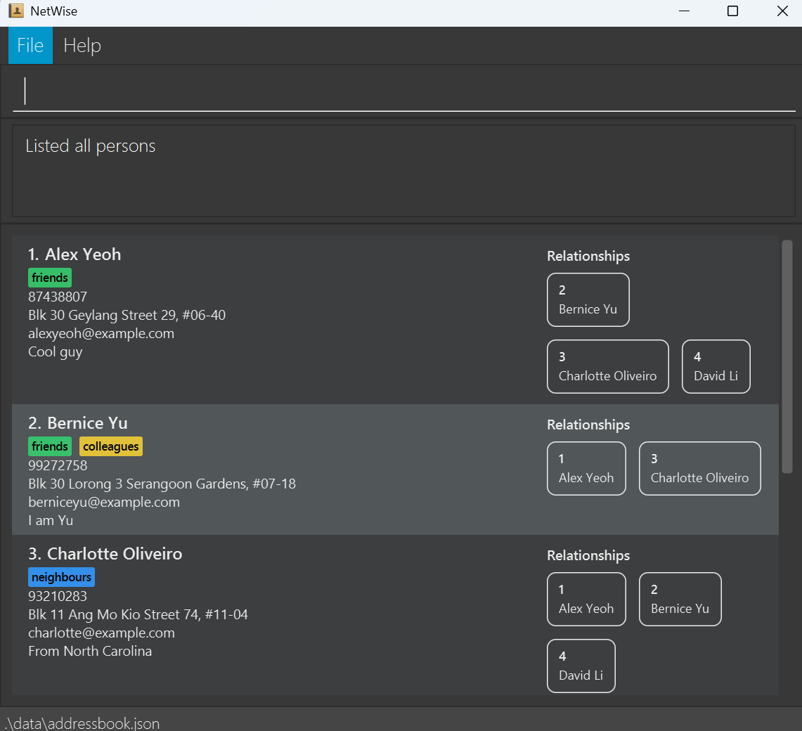

NetWise is a **desktop app for managing connections for Computer Science students, optimized for use via a
Command Line Interface** (CLI) while still having the benefits of a Graphical User Interface (GUI).
If you can type fast, NetWise can get your connection management tasks done faster than traditional GUI apps.

* Table of Contents
{:toc}

--------------------------------------------------------------------------------------------------------------------

## Quick start

1. Ensure you have Java `17` or above installed in your Computer. 
   **Mac users:** Ensure you have the precise JDK version prescribed
    [here](https://se-education.org/guides/tutorials/javaInstallationMac.html).

1. Download the latest `.jar` file from [here](https://github.com/AY2526S1-CS2103T-T16-1/tp/releases).

1. Copy the file to the folder you want to use as the _home folder_ for your NetWise.

1. Open a command terminal, `cd` into the folder you put the jar file in, and use the `java -jar NetWise.jar` command to run the application. 
   A GUI similar to the below should appear in a few seconds. Note how the app contains some sample data. 
   

1. Type the command in the command box and press Enter to execute it. e.g. typing **`help`** and pressing Enter will open the help window. 
   Some example commands you can try:

   * `list` : Lists all connections.

   * `add n/John Doe p/98765432 e/johnd@example.com a/John street, block 123, #01-01` : Adds a connection named
   `John Doe` to NetWise.

   * `delete 3` : Deletes the connection with ID 3.

   * `clear` : Deletes all connections.

   * `exit` : Exits the app.

1. Refer to the [Features](#features) below for details of each command.

--------------------------------------------------------------------------------------------------------------------

## Features

**:information_source: Notes about the command format:** 

* Words in `UPPER_CASE` are the parameters to be supplied by the user. 
  e.g. in `add n/NAME`, `NAME` is a parameter which can be used as `add n/John Doe`.

* Items in square brackets are optional. 
  e.g `n/NAME [t/TAG]` can be used as `n/John Doe t/friend` or as `n/John Doe`.

* Items with `…`​ after them can be used multiple times including zero times. 
  e.g. `[t/TAG]…​` can be used as ` ` (i.e. 0 times), `t/friend`, `t/friend t/family` etc.

* Parameters can be in any order. 
  e.g. if the command specifies `n/NAME p/PHONE_NUMBER`, `p/PHONE_NUMBER n/NAME` is also acceptable.

* Extraneous parameters for commands that do not take in parameters (such as `help`, `list`, `exit` and `clear`) will be ignored. 
  e.g. if the command specifies `help 123`, it will be interpreted as `help`.

* If you are using a PDF version of this document, be careful when copying and pasting commands that span multiple lines as space characters surrounding line-breaks may be omitted when copied over to the application.

### Viewing help : `help`

Shows a message explaining how to access the help page.

Format: `help`

### Adding a connection : `add`

Adds a connection to NetWise. A *connection* is someone who you want to keep in contact, such as
friends, colleagues or people you met from a networking event.

Format: `add n/NAME p/PHONE e/EMAIL [a/ADDRESS] [t/TAG_ID]…​ [r/NOTE]`

:bulb: **Tip:**
A connection can have any number of tags (including 0)

* `NAME` should only contain alphanumeric characters, commas, full-stops, apostrophes and spaces, and it must not be empty. 
  * Name should be unique. The same name must not be repeated, case-sensitive (i.e. 'Ben' is different from 'ben')
* `PHONE` should only contain numbers, a plus `+` only at the beginning for country code, and spaces or dashes `-`
  * There should be at least **two** numbers between every spaces/dashes.
  * The phone number should be at least 5 digits long (not counting the special characters/spaces)
* `EMAIL` should be of format `local-part@domain` and adhere to the following constraints:
  * `local-part` should only contain alphanumeric characters and these special characters: `+`, `-`, `.`, `_`. The local-part may not start or end with any special characters.
  * This is followed by a '@' and then a `domain`. The `domain` is made up of domain labels separated by periods. There should be at least
  two domain labels, with the final domain label (i.e. `.com`, `.sg`, `.net`, etc.) should have at least 2 characters.
* `TAG_ID` refers to the **unique ID** of each tag (**not** their names), can be seen by using the [`listtag`](#listing-all-tags-listtag) command. 
  * The tag ID **must be a positive integer** 1, 2, 3, …​
  * One user can be assigned multiple tag IDs, and these do not have to be in any order (i.e. `t/1 t/3` and `t/3 t/1` will both assign tags with IDs 1 and 3 to the connection)
* `NOTE` can accept any character input of any length.

Examples:
* `add n/John Doe p/98765432 e/johnd@example.com a/John street, block 123, #01-01`
* `add n/Betsy Crowe e/betsycrowe@example.com a/Newgate Prison p/1234567 t/1 r/She owed me lunch`,
supposed tag with ID 1 is `criminal`

### Listing all connections : `list`

Shows a list of all connections in NetWise.

Format: `list`

### Editing a connection : `edit`

Edits an existing connection in NetWise.

Format: `edit ID [n/NAME] [p/PHONE] [e/EMAIL] [a/ADDRESS] [t/TAG_ID]…​ [r/NOTE]`

* Edits the connection with the specified `ID`.
* The `ID` refers to the **unique ID** each connection is given when created,
can be seen with [`list`](#listing-all-tags--listtag).
  * The `ID` **must be a positive integer** 1, 2, 3, …​
* If the connection with the input `ID` does not exist in the list, expect a message informing that no person found.
* Further conditions for `NAME`, `PHONE`, `EMAIL`, `ADDRESS`, `TAG_ID`, and `NOTE` follows the same as in [`add`](#adding-a-connection--add).
* Existing values will be updated to the input values.
* When editing tags, the existing tags of the connection will be removed, i.e adding of tags is not cumulative.

:bulb: **Tip:**
You can remove all the connection’s tags by typing `t/` without specifying any tags after it.

Examples:
*  `edit 1 p/91234567 e/johndoe@example.com` Edits the phone number and email address of the connection with ID 1
to be `91234567` and `johndoe@example.com` respectively.
*  `edit 2 n/Betsy Crower t/` Edits the name of the connection with ID 2 to be `Betsy Crower` and
clears all existing tags.

### Deleting a connection : `delete`

Deletes the specified connection from NetWise.

Format: `delete ID`

* Deletes the connection with the specified `ID`.
* The `ID` refers to the **unique ID** each connection is given when created, can be seen with [`list`](#listing-all-connections--list).
* If the connection with the input `ID` does not exist in the list, expect a message informing that no person found.
* The `ID` **must be a positive integer** 1, 2, 3, …​
* If the connection with the input `ID` does not exist in the list, expect a message informing that no person found.

Examples:
* `list` followed by `delete 2` deletes the connection with ID 2 in NetWise.
* `find Betsy` followed by `delete 1` deletes the connection with ID 1 in the results of the `find` command.

### Clearing all connection entries : `clear`

Clears all connection entries from NetWise.

Format: `clear`

### Locating connections by fields : `find`

Finds all connections (persons) whose specified fields contain any of the given keywords.
Matching is **case-insensitive** and supports **substring** (for most fields) and **word-based** (for tags) matching.

Format: `find [n/NAME_KEYWORDS]…​ [p/PHONE_KEYWORDS]…​ [e/EMAIL_KEYWORDS]…​ [a/ADDRESS_KEYWORDS]…​ [t/TAG_ID]…​`

* **At least ONE** field (`n/`, `p/`, `e/`, `a/`, `t/`) must be provided.
* Each field can take one or more keywords separated by spaces.
* Matching is partial for name, phone, email, and address (e.g., `n/Ali` matches “Alice”).
* Matching is exact (ID-based) for tags (e.g., `t/5` only matches tag with ID 5, **not** that contains the character "5").
* Unlike [`add`](#adding-a-connection--add) and [`edit`](#editing-a-connection--edit) commands, the keyword parameters
does not have any input restrictions for flexibility.
* Empty input fields (i.e. `n/` or `p/    ` (whitespaces)) will **not** be taken into account when filtering for connections. 
* The search across different fields uses **AND logic** — a person must match all fields provided.
  (e.g. `n/Ali e/gmail` finds persons whose **name contains “Ali”** *and* **email contains “gmail”**.)
* The search within the same field uses **OR logic** — any one of the field’s keywords will match.
  (e.g. `a/Clementi a/Bishan` finds persons living in *either* Clementi *or* Bishan.)
* **Note**: `find` does not support locating connections by *notes*.

Examples:
* `find n/Ali` → Finds all persons with names containing “Ali”.
* `find e/gmail a/Clementi` → Finds persons whose email contains “gmail” and address contains “Clementi”.
* `find n/Ali e/gmail a/Clementi a/Bishan t/2 t/5 t/7` → Finds persons who:
    * name contains “Ali”:
    * email contains “gmail”,
    *	address contains “Clementi” or “Bishan”, and
    *	has tag IDs 2, 5, or 7.

### Adding a tag : `addtag`

Adds a tag to NetWise. A tag is a keyword or label used to categorise and organise your connections.

Format: `addtag n/NAME [d/DESCRIPTION] [c/RGB_COLOR]`

* Add a tag into NetWise, along with an optional description and tag colour.
* `NAME` should only contain alphanumeric characters, and it must not be empty.
  * Name should be unique. The same name must not be repeated, case-sensitive (i.e. 'FRIEND' is different from 'friend')
* `DESCRIPTION` can accept any character input of any length.
* The `RGB_COLOR` describe the colour you want to set for the tag.
* `RGB_COLOR` field *must* be a HEX colour string of length 6, case-insensitive, and must not be left empty if the prefix is included.
  * The string should be written ***without*** the hash ('#'), such as `123456`, `0F2AAB`, `abf1cd`, …​
* The default `DESCRIPTION` field is "No description" (if prefix is not included)
* The default `RGB_COLOR` is gray (#808080) (if prefix is not included)
* The created tag will be assigned a **FIXED unique tag ID**, can be seen with the [`listtag`](#listing-all-tags--listtag) command.

Examples:
* `addtag n/JC d/JC friends c/23f1cd`
* `addtag n/coworkers`

### Listing all tags : `listtag`

Shows a list of all tags in NetWise.

Format: `listtag`

* List all tags along with their description and assigned color.
* The tag list does not show tags in any particular order.
It shows the tag name along with the associated **unique tag ID** given when the tag is created.

### Editing a tag : `edittag`

Edits a tag in NetWise.

Format: `edittag TAG_ID [n/NAME] [d/DESCRIPTION] [c/RGB_COLOR]`

* Edits the tag at the specified `TAG_ID`.
* `TAG_ID` refers to the **unique tag ID** each tag is given when created, can be seen with
[`listtag`](#listing-all-tags--listtag).
  * `TAG_ID` **must be a positive integer** 1, 2, 3, …​
* If the tag with the input `TAG_ID` does not exist in the list, expect a message informing that no tag found.
* Further conditions for `NAME`, `DESCRIPTION`, and `RGB_COLOR` follows the same as in [`addtag`](#adding-a-tag--addtag).
* At least one of the optional fields must be provided.
* Existing values will be updated to the input values.

Examples:
* `edittag 1 d/my extended family c/099fca` changes the description of tag 1 to "my extended family",
and set its color to the color with hex code #099fca.
* `edittag 2 n/Prof d/ c/` changes the name of tag 1 to "Prof", and set both description and color to default
value mentioned [above](#adding-a-tag--addtag).

### Deleting a tag : `deletetag`

Deletes a tag from NetWise.

Format: `deletetag TAG_ID`

* Deletes the tag at the specified `TAG_ID`.
* `TAG_ID` refers to the **unique ID** each tag is given when created, can be seen with
[`listtag`](#listing-all-tags--listtag).
  * `TAG_ID` **must be a positive integer** 1, 2, 3, …​
* If the tag with the input `TAG_ID` does not exist in the list, expect a message informing that no tag found.

Example:
* `delete 2` to delete the tag with ID 2

### Adding a relationship : `addrel`

Adds a relationship to NetWise. A *relationship* links any two connections together.

Format: `addrel p1/CONNECTION_1 p2/CONNECTION_2 d/DESCRIPTION`

* `CONNECTION_1` and `CONNECTION_2` refers to the unique IDs of the two connections that this relationship links.
  * `CONNECTION_1` and `CONNECTION_2` **must be a positive integer** 1, 2, 3, …​
* If either, or both, of the connections `CONNECTION_1` and `CONNECTION_2` do not exist in the list, expect a message informing that no tag found.
* `DESCRIPTION` is a field to describe the relationship, e.g.: colleagues from ABC company
* `DESCRIPTION` can accept any character input of any length.

Examples:

* `addrel p1/1 p2/2 d/childhood friends`. Adds a relationship between the connections with ID 1 and 2, noting
that they are childhood friends.

### Listing all relationships : `listrel`

Shows a list of relationships for each person in the list in NetWise.

Format (one person): `listrel p1/CONNECTION_1`: show a list of all person related to `CONNECTION` along with the relationship info
Format (two persons): `listrel p1/CONNECTION_1 p2/CONNECTION_2`: show all relationships between `CONNECTION_1` and `CONNECTION_2` (if exist), along with the relationship infos.

* `CONNECTION_1` and `CONNECTION_2` refers to the unique IDs of the two connections that this relationship links.
    * `CONNECTION_1` and `CONNECTION_2` **must be a positive integer** 1, 2, 3, …​
* If either, or both, of the connections `CONNECTION_1` and `CONNECTION_2` do not exist in the list, expect a message informing that no tag found.

### Editing a relationship : `editrel`

Edits a relationship in NetWise.

Format: `editrel INDEX [p1/CONNECTION_1] [p2/CONNECTION_2] [d/DESCRIPTION]`

* Edits the relationship at the specified index `INDEX` in the relationship list from `listrel`.
* At least one of the optional fields must be provided.
* Existing values will be updated to the input values.

Examples:

* `editrel 3 d/highschool friends`. Edits description of the third relationship in the relationship list.

### Deleting a relationship : `deleterel`

Deletes a relationship from NetWise.

Format: `deleterel INDEX`

* Deletes the relationships at the specified index `INDEX` in the relationship list from `listrel`.

Examples:

* `deleterel 1`. Deletes the first relationship in the relationship list.

### Exiting the program : `exit`

Exits the program.

Format: `exit`

### Navigate through command history using up/down arrow

Using the up/down arrow keys, user can navigate through their command history, displaying the commands on the command line.

* **Up Arrow Key**: Cycle backward through previously executed commands.
* **Down Arrow Key**: Cycle forward through the command history, moving from older commands to more recent ones that have already been displayed using the up arrow key.

### Saving the data

NetWise data are saved in the hard disk automatically after any command that changes the data.
There is no need to save manually.

### Editing the data file

NetWise data are saved automatically as a JSON file `[JAR file location]/data/addressbook.json`.
Advanced users are welcome to update data directly by editing that data file.

:exclamation: **Caution:**
If your changes to the data file makes its format invalid, NetWise will discard all data and start with an
empty data file at the next run. Hence, it is recommended to take a backup of the file before editing it.
 
Furthermore, certain edits can cause NetWise to behave in unexpected ways
(e.g., if a value entered is outside of the acceptable range).
Therefore, edit the data file only if you are confident that you can update it correctly.

--------------------------------------------------------------------------------------------------------------------

## FAQ

**Q**: How do I transfer my data to another Computer? 
**A**: Install the app in the other computer and overwrite the empty data file it creates with the file that
contains the data of your previous NetWise home folder.

--------------------------------------------------------------------------------------------------------------------

## Known issues

1. **When using multiple screens**, if you move the application to a secondary screen, and later switch to using
only the primary screen, the GUI will open off-screen. The remedy is to delete the `preferences.json` file created
by the application before running the application again.
2. **If you minimize the Help Window** and then run the `help` command (or use the `Help` menu, or the
keyboard shortcut `F1`) again, the original Help Window will remain minimized, and no new Help Window will appear.
The remedy is to manually restore the minimized Help Window.
3. **When editing on the command line**, it is known that every keyboard inputs would bring the text cursor back to line
end. This will be fixed in the upcoming updates.

--------------------------------------------------------------------------------------------------------------------

## Command summary

| Action                    | Format, Examples                                                                                                                                                                  |
|---------------------------|-----------------------------------------------------------------------------------------------------------------------------------------------------------------------------------|
| **Add connection**        | `add n/NAME p/PHONE_NUMBER e/EMAIL [a/ADDRESS] [t/TAG]…​ [r/NOTE]`   e.g., `add n/James Ho p/22224444 e/jamesho@example.com a/123, Clementi Rd, 1234665 t/1 2 r/owes me lunch` |
| **List connection**       | `list`                                                                                                                                                                            |
| **Edit connection**       | `edit ID [n/NAME] [p/PHONE_NUMBER] [e/EMAIL] [a/ADDRESS] [t/TAG]…​ [r/NOTE]`  e.g.,`edit 2 n/James Lee e/jameslee@example.com`                                                 |
| **Delete connection**     | `delete ID`  e.g., `delete 3`                                                                                                                                                  |
| **Clear connection list** | `clear`                                                                                                                                                                           |
| **Find connection**       | `find KEYWORD [MORE_KEYWORDS]`  e.g., `find James Jake`                                                                                                                        |
| **Add tag**               | `addtag n/NAME [d/DESCRIPTION] [c/RGB_COLOR]`   e.g. `addtag n/JC d/JC friends c/23f1cd`                                                                                       |
| **List tag**              | `listtag`                                                                                                                                                                         |
| **Edit tag**              | `edittag ID [n/NAME] [d/DESCRIPTION] [c/RGB_COLOR]`   e.g. `edittag 1 d/my extended family c/099fca`                                                                           |
| **Delete tag**            | `deletetag ID`   e.g. `deletetag 2`                                                                                                                                            |
| **Add relationship**      | `addrel p1/CONNECTION_1 p2/CONNECTION_2 d/DESCRIPTION`   e.g. `addrel p1/1 p2/2 d/friends`                                                                                     |
| **List relationships**    | `listrel`                                                                                                                                                                         |
| **Edit relationship**     | `editrel INDEX [p1/CONNECTION_1] [p2/CONNECTION_2] [d/DESCRIPTION]`   e.g. `editrel 1 d/friends`                                                                               |
| **Delete relationship**   | `deleterel INDEX`   e.g. `deleterel 1`                                                                                                                                         |
| **Help**                  | `help`                                                                                                                                                                            |
| **Exit program**          | `exit`                                                                                                                                                                            |
